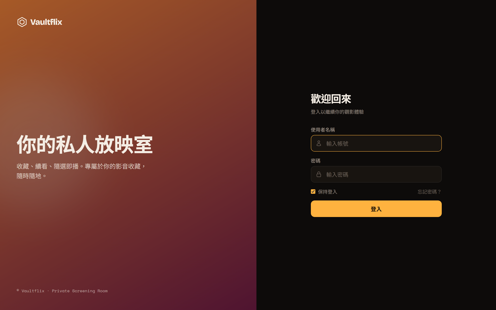
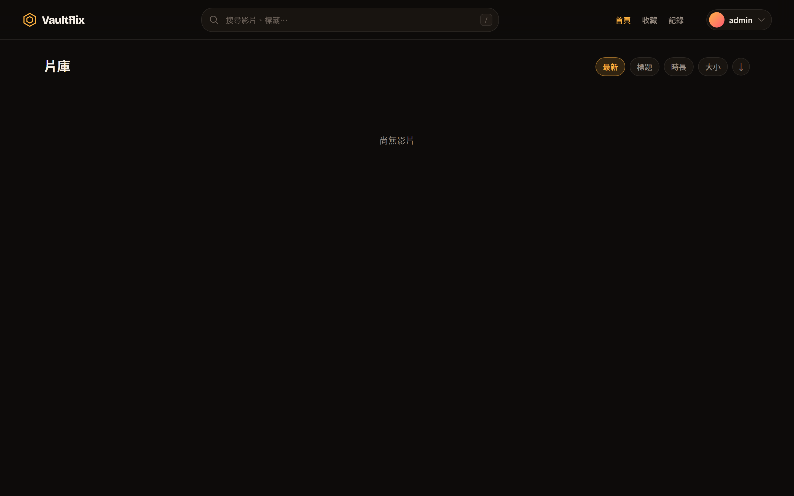
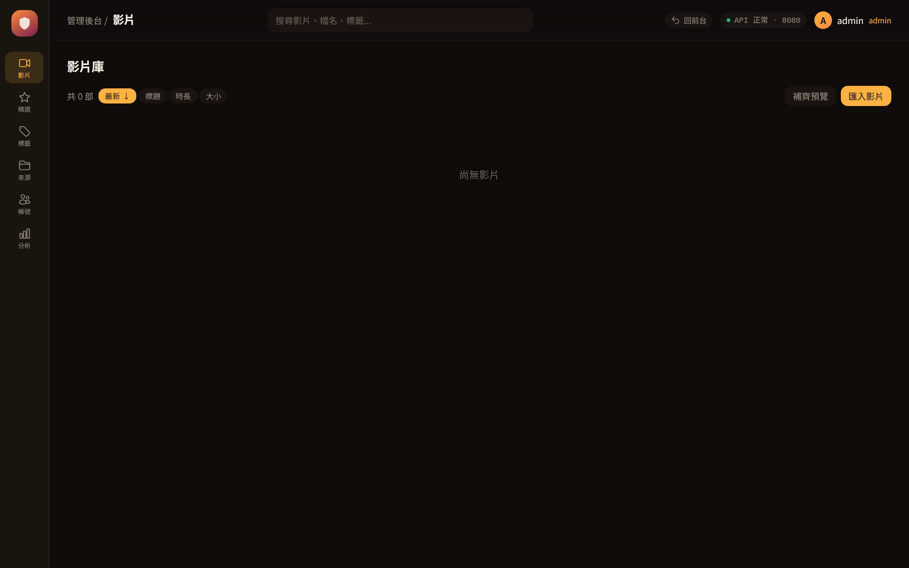
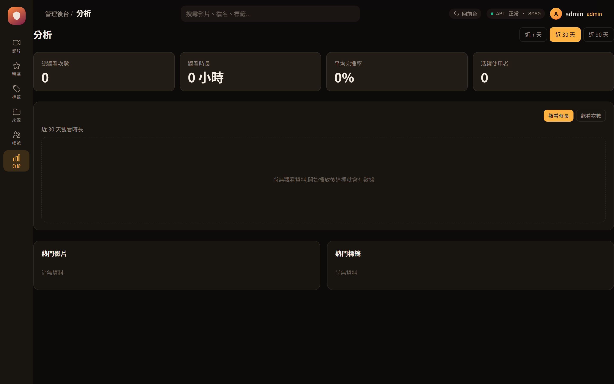

# Day 1: Vaultflix 的前世今生

這次的鐵人賽想說趁著這波AI風氣，來展示一下自己vibe coding的專案，也就是標題提到的[*vaultflix*](https://github.com/steven715/vaultflix)，同時也分享自己跟AI互動的部分

## Vaultflix: 動機

專案動機來自於作為一個異性戀的男性，小時候有收集一些日本愛情動作片的習慣，但這些片片只能透過檔案總管或是一些播放器才能播放，在youtube越來越成為一種影音播放的主流下，就萌生想把自己的這些收藏也能像YT影片那樣展示出來。

這專案其實是我在2024年就想做的項目，也是作為當年鐵人賽的主題，但最後因工作太忙就沒接續了。

而從今年開始AI已經明顯作為整個軟體的開發主力，包含我自己工作上都沒什麼在寫代碼了，所以就想說試試看這個專案，看AI到底能發揮多大的能力，我主要都是使用*Claude Code*。

另外要特別強調，我這專案有不少部分是參考[Jellyfin](https://jellyfin.org/)，因為我當初的動機，其實跟Jellyfin很像，所以當初在構思的時候就有注意到這專案。

但不得不說，我認為這也是AI時代最好的部分，因為我不是Jellyfin，我不需要他那套完整的功能，我可以就我自己的需求出發，做我符合我需要的部分就好。

## Vaultflix: 功能

這專案提供兩個角色，管理者跟觀看者

管理者有以下功能
- 上傳、下架影片
  - 目前只支援服務器上有的硬碟能上傳影片
- 標籤影片
- 推薦影片
- 管理觀看者
- 觀看影片

觀看者就是單純登入看影片

除此之外還有以下功能

- 每日推薦
- 影片預覽
- 統計觀看數據
- PWA

## Vaultflix: 畫面展示

展示的部分，不得不推一下 *claude design*，真的是對不會UX的工程師超級友好的神器

登入頁：

觀看者進來看到的片庫：

管理者的影片管理頁，上架、下架、標籤、匯入都在這裡：

管理者的觀看統計頁：

## Vaultflix: 推廣

這邊想推廣一下自己的作品，如果有想要把自己的一些影片收藏作展示的，可以試試看 [*vaultflix*](https://github.com/steven715/vaultflix)，那如果使用上有發現不好用或體驗差的部分，也十分歡迎在文章下留言或github上提issue~

## 結尾

今天就先簡單介紹vaultflix的樣貌，明天再來分享vaultflix中更深入的部分。
